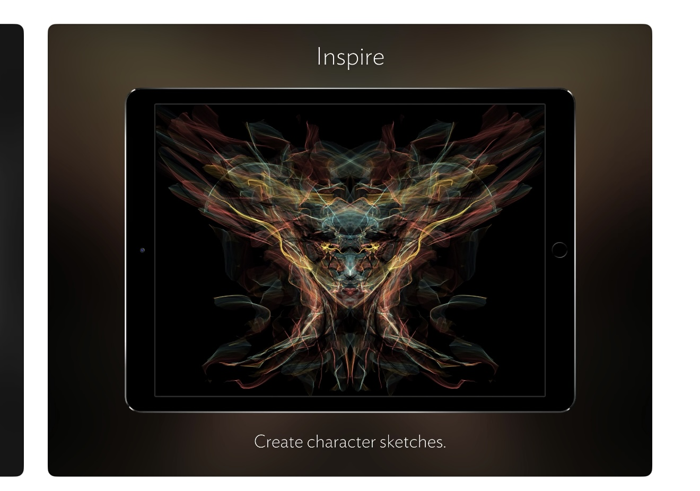
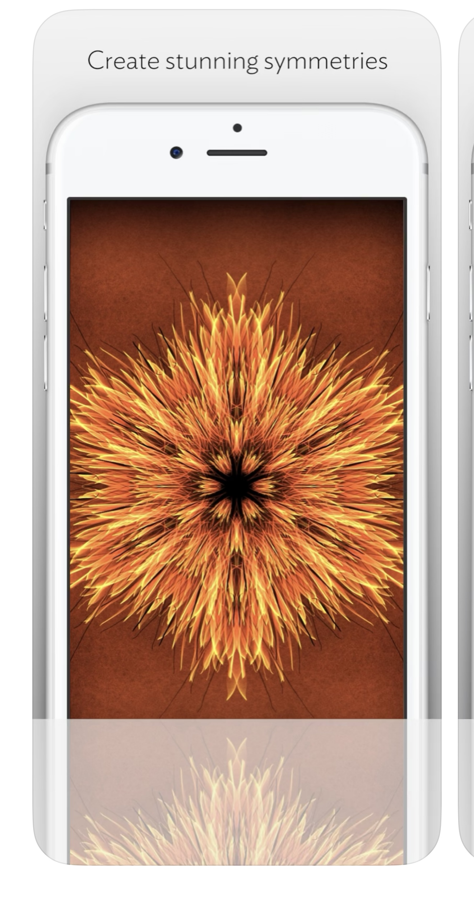
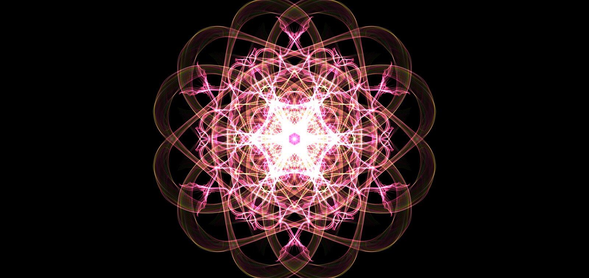
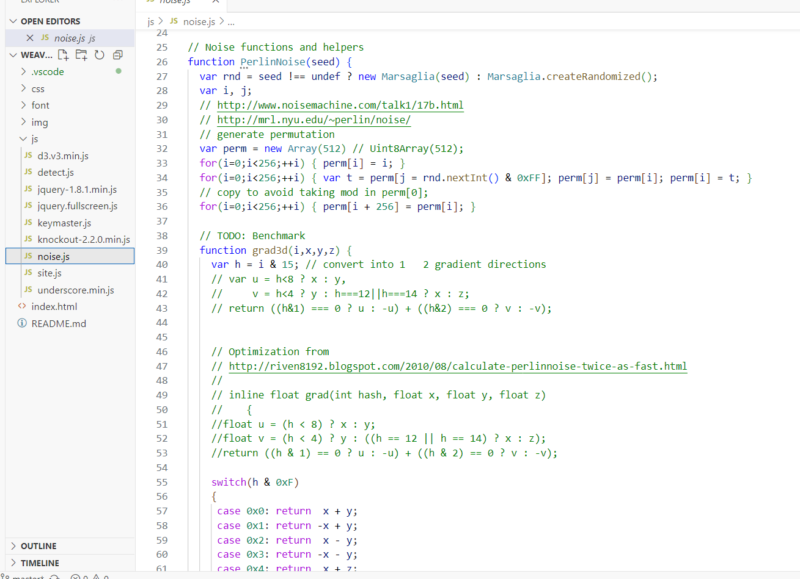

# qzen0648_9103_tut1

# Quiz 8

## Part 1: Imaging Technique Inspiration

**Silk – Interactive Generative Art**  
My inspiration comes from Silk, an interactive generative art piece that creates continuous, multi-layered spiral patterns. Each translucent stroke radiates outward from the centre, gradually building a glowing vortex of colour. This layered transparency and radial motion captures a sense of ongoing rotation and expanding energy—almost like a visual representation of the cosmos, fate, or emotional flow. The work’s rhythmic and evolving aesthetic strongly aligns with the atmosphere I hope to convey in my final project, offering available visual language that informs both the concept and structure of my creative coding design.

## Part 2: Coding Technique Exploration

**p5.js 'rotate()','for loop' and Perlin Noise**  
By shifting the canvas coordinate system to the centre and applying slight rotational changes each frame, a ‘for loop’ and Perlin Noise can be used to layer semi-transparent shapes in a way that produces a dynamic spiral effect. This approach, using p5.js’s built-in ‘translate()’ and ‘rotate()' functions, allows for a clear sense of radial movement and layered rhythm. It closely reflects the aesthetic seen in Silk, with its multi-layered, transparent rotation, and offers a practical technique for exploring ideas of energy, motion, and central focus in my final project’s visual design.

Example code: [p5.js Silk 2](https://github.com/SipSup3314/Weave-Silk-Source-Code)
Example code: [Silk – Interactive Generative Art_files](https://github.com/yt-theme/weavesilk.git)  